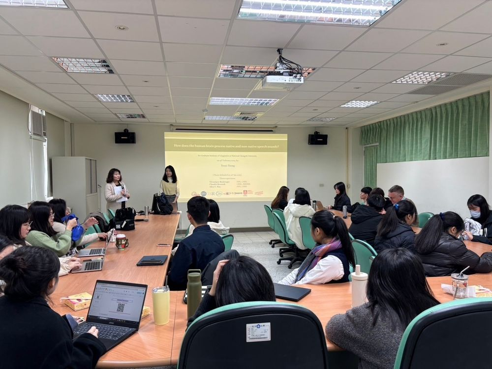
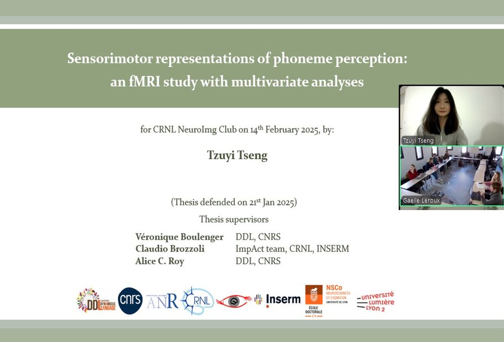

### General News

<li><b>***Tzuyi Tseng is seeking a postdoctoral position in neurolinguistics.***</b></li>
<li>21 January 2025: Tzuyi Tseng defended her doctoral thesis!</li>
<li>21 January 2025: Tzuyi Tseng defended her doctoral thesis!</li>

### Publication Updates

<li>21 May 2025: <u>Tseng, T.</u> et al. (under review) Embodied speech: sensorimotor contributions to native and non-native phoneme processing and learning. received positive comments from the editor of <a href="https://direct.mit.edu/nol">Neurobiology of Language</a>, and is now under revision!</li>
<li>21 March 2025: <u>Tseng, T.</u> et al. (prepint) Embodied speech: sensorimotor contributions to native and non-native phoneme processing and learning. is updated on <a href="https://osf.io/preprints/psyarxiv/fqwe8">PsyArXiv</a>, and submitted to <a href="https://direct.mit.edu/nol">Neurobiology of Language</a>!</li>
<li>08 November 2025: <u>Tseng, T.</u> et al. Embodied speech: sensorimotor contributions to native and non-native phoneme processing and learning. is now a preprint on <a href="https://osf.io/preprints/psyarxiv/fqwe8">PsyArXiv</a>.</li>

### News on Invited Talks

  

    
    
19 February 2025: Tzuyi gave a invited talk "How does the human brain process native and non-native speech sounds?" at <a href="https://ling.nccu.edu.tw/eng/PageFront">Graduate Institute of Linguistics</a>, National Chengchi University, Taipei, Taiwan.

  

  

  

    
    
14 February 2025: Tzuyi gave a invited talk "Sensorimotor representations of phoneme perception: an fMRI study with multivariate analyses." online for <a href="https://osf.io/sxkgq/">NeuroImaging Club</a>, CRNL, Bron, France. <a href="https://pod.inserm.fr/video/2239-neuroimaging-club-tzuyi-tseng-202502/">[video] Club</a>

  

  

### News on Scientific Activities

<li>03 July 2025: Tzuyi gave a laboratory presentation "What do know about emotion, language and the brain? A glimpse into current research." at <a href="https://www.crnl.fr/fr/equipe/impact">ImpAct</a> Journal Club, CRNL, Bron, France. <a href="https://bsky.app/profile/tzuyitseng.bsky.social/post/3lt2thpfgsk2p">[picture]</a></li>
<li>24 June 2025: Tzuyi gave a laboratory presentation "First steps toward emotion recognition across languages: a preliminary behavioral and fMRI protocol." at <a href="http://www.ddl.cnrs.fr/">DDL</a> Club PAD (Protocole à la Demande/Protocol on Demand), Lyon, France. <a href="https://bsky.app/profile/tzuyitseng.bsky.social/post/3lsh6fxqa3223">[picture]</a></li>
<li>20 February 2025: Tzuyi gave a public talk "Sensorimotor representation of native and non-native phoneme perception and its application for foreign language learning." at <a href="https://homepage.ntu.edu.tw/~gilntu/">Graduate Institute of Linguistics</a>, National Taiwan University, Taipei, Taiwan. <a href="https://bsky.app/profile/tzuyitseng.bsky.social/post/3lilze57ggc2z">[picture]</a></li>

